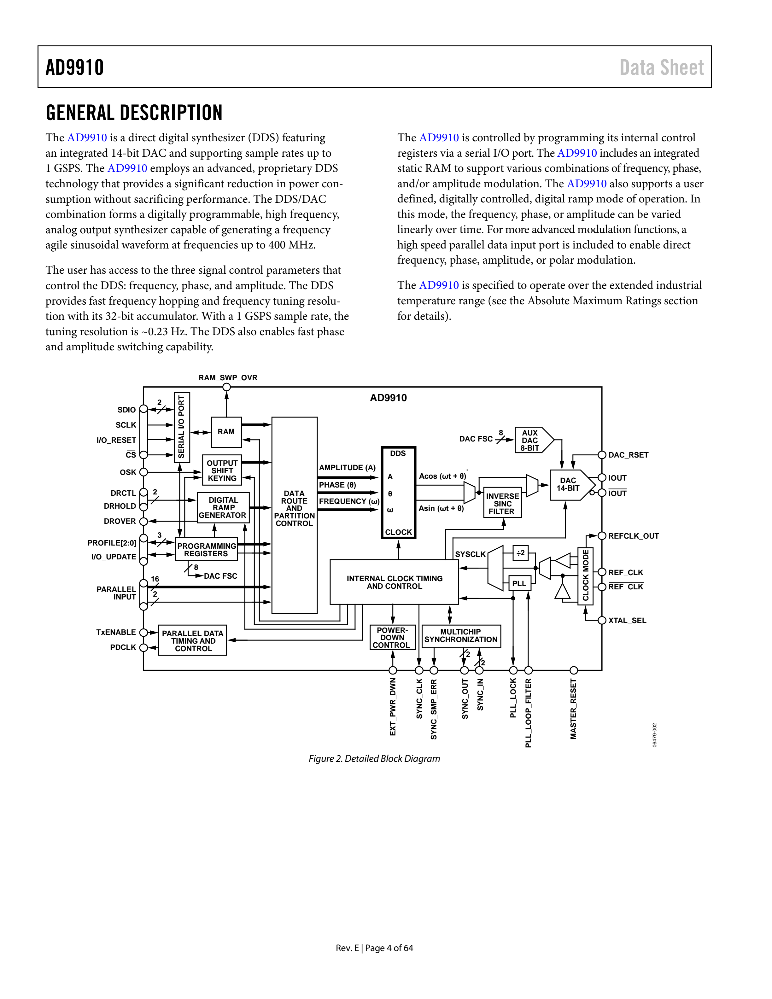
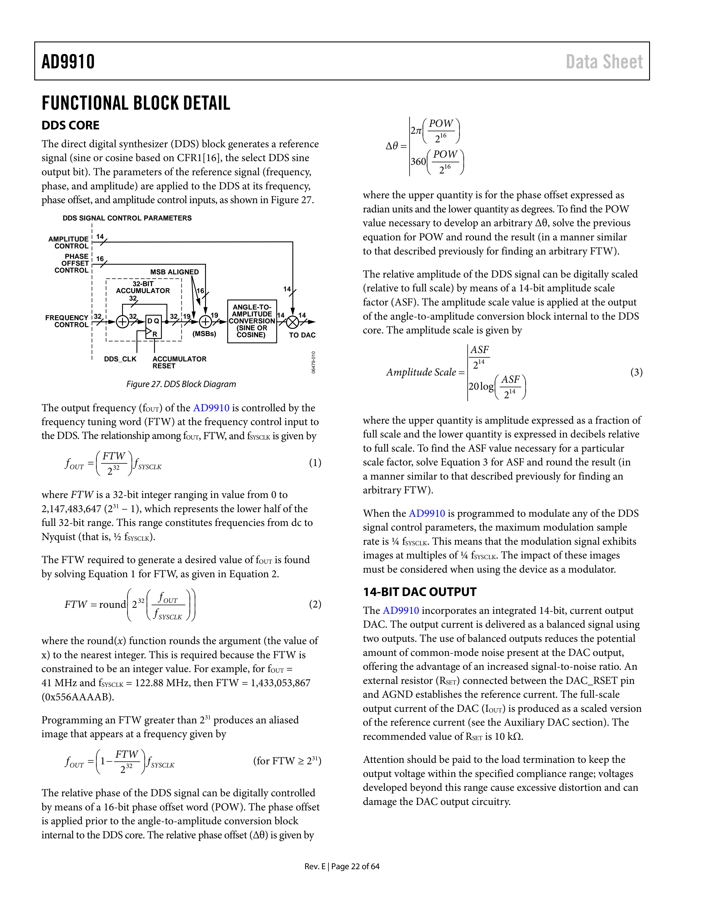
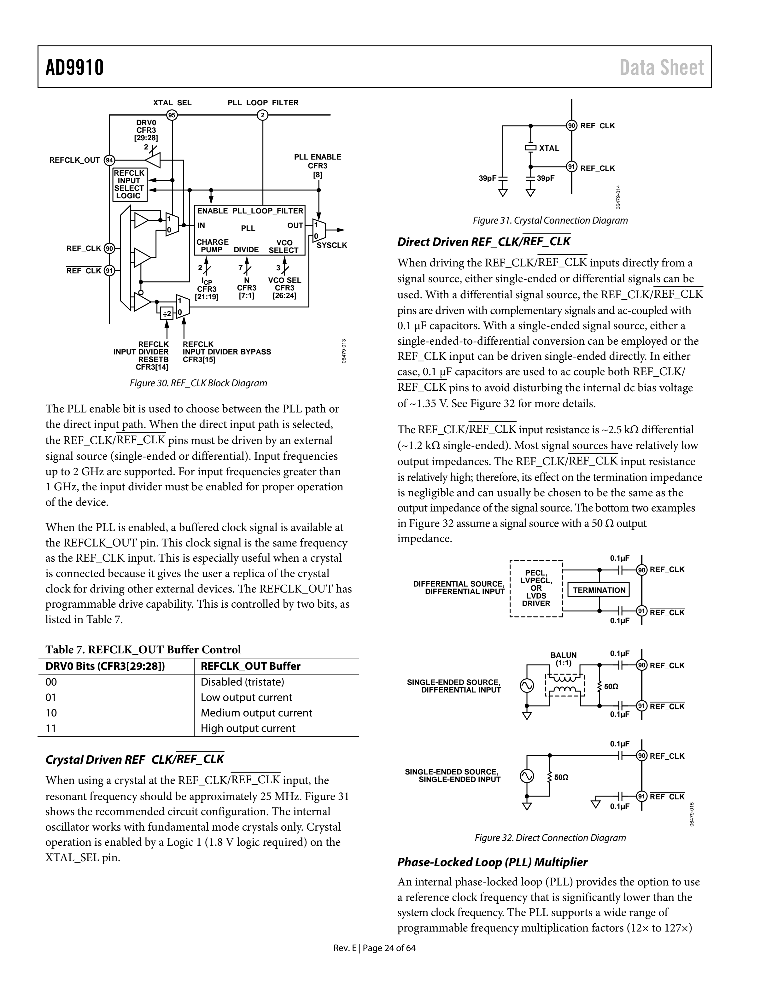
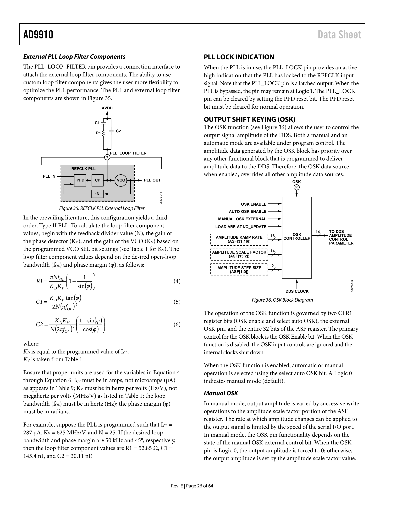
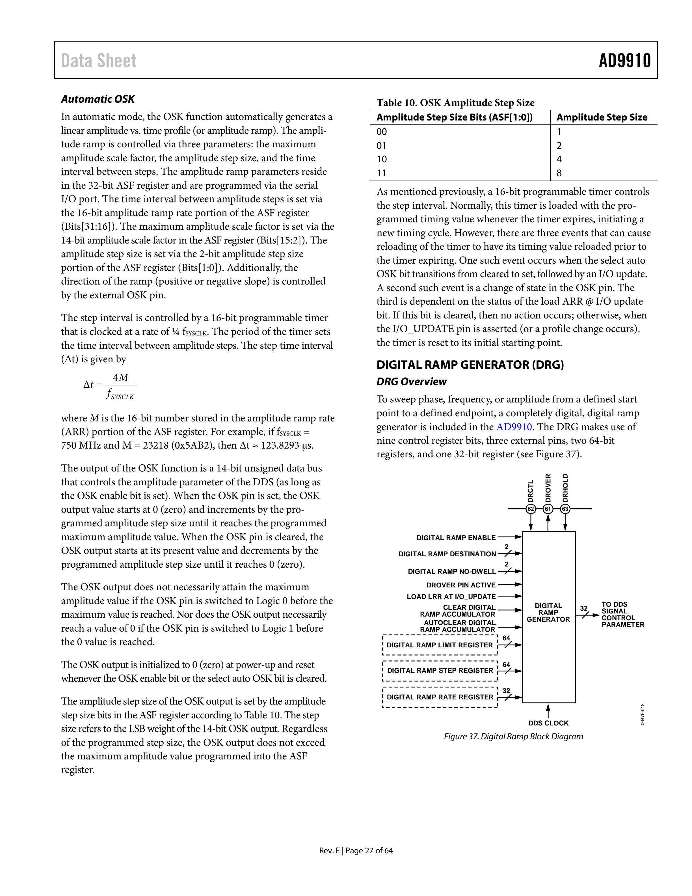
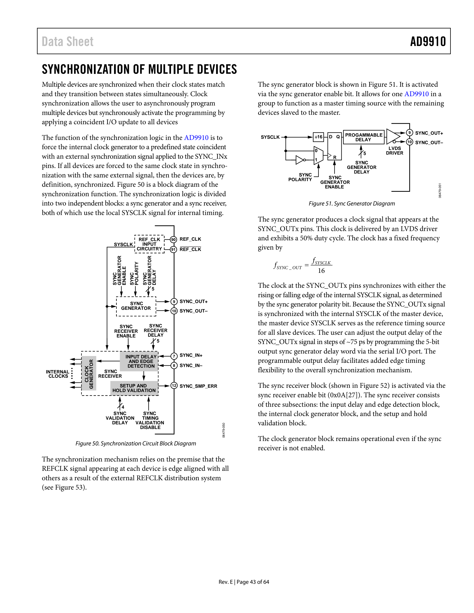

# AD9910 数据手册

## 特性 (Features)

*   **1 GSPS 内部时钟速度**（高达 400 MHz 模拟输出）
*   **集成 1 GSPS, 14-Bit DAC**
*   **0.23 Hz 或更佳的频率分辨率**
*   **相位噪声 ≤ −125 dBc/Hz @ 1 kHz 偏移 (400 MHz 载波)**
*   **出色的动态性能**，>80 dB 窄带 SFDR
*   **串行输入/输出 (I/O) 控制**
*   **自动线性或任意频率、相位和幅度扫描能力**
*   **8 个频率和相位偏移配置文件 (Profiles)**
*   **Sin(x)/(x) 修正 (反 sinc 滤波器)**
*   **1.8 V 和 3.3 V 电源供电**
*   **软件 and 硬件控制的功耗下降 (Power-down)**
*   **100 引脚 TQFP_EP 封装**
*   **集成 1024 字 × 32 位 RAM**
*   **PLL REFCLK 倍增器**
*   **并行数据路径接口**
*   **内部振荡器可由单个晶体驱动**
*   **相位调制能力**
*   **幅度调制能力**
*   **多芯片同步**

## 应用 (Applications)

*   敏捷本地振荡器 (LO) 频率合成
*   可编程时钟发生器
*   用于雷达和扫描系统的 FM 线性调频 (Chirp) 源
*   测试和测量设备
*   声光器件驱动器
*   极坐标调制器 (Polar modulators)
*   快速跳频

## 功能框图 (Functional Block Diagram)

*(注：当前已嵌入提取到的详细功能框图页面图像，用于覆盖原文中的功能/系统框图参考需求。)*

---

## 修订历史 (Revision History)

| 修订版本 | 日期 | 描述 |
| :--- | :--- | :--- |
| Rev. E | 10/2016 | 更改 Figure 48; 更改 Figure 33; 删除 I/O_UPDATE 引脚章节; 更改 Profiles 章节 |
| Rev. D | 05/2012 | 更改 Table 1; 更改 Table 3; 更改 Figure 39; 更改多芯片同步章节; 增加 I/O_UPDATE, SYNC_CLK 和系统时钟关系章节; 增加 Figure 49 |
| Rev. C | 08/2010 | 更改 Table 1 中的 XTAL_SEL 输入参数; 更改 Table 2; 更改 TxENABLE 章节 |
| Rev. B | 12/2008 | 更改 Figure 2; 更改 Table 1 中的 I/O_UPDATE 脉冲宽度参数等 |
| Rev. A | 02/2008 | 更改 Table 1 中的 REFCLK 倍增器规格; 更改 SYNC_CLK 的最小建立时间等 |
| Rev. 0 | 05/2007 | 初始版本 |

---

## 一般说明 (General Description)

AD9910 是一款直接数字频率合成器 (DDS)，具有集成的 14 位 DAC，支持高达 1 GSPS 的采样率。AD9910 采用先进的专利 DDS 技术，在不牺牲性能的情况下显著降低了功耗。DDS/DAC 组合形成了一个数字可编程、高频、模拟输出合成器，能够生成高达 400 MHz 的频率敏捷正弦波形。

用户可以使用三个信号控制参数来控制 DDS：频率、相位和幅度。DDS 通过其 32 位累加器提供快速跳频和频率调谐分辨率。在 1 GSPS 采样率下，调谐分辨率约为 0.23 Hz。DDS 还实现了快速相位和幅度切换能力。

AD9910 通过串行 I/O 端口编程其内部控制寄存器来控制。AD9910 包括一个集成的静态 RAM，以支持频率、相位和/或幅度调制的各种组合。AD9910 还支持用户定义的、数字控制的数字扫描模式。在这种模式下，频率、相位或幅度随时间线性变化。对于更高级的调制功能，包含一个高速并行数据输入端口，以实现直接的频率、相位、幅度或极坐标调制。

AD9910 额定工作在扩展工业温度范围内（详情请参阅“绝对最大额定值”部分）。

---

## 规格 (Specifications)

### 电气规格 (Electrical Specifications)

AVDD (1.8 V) 和 DVDD (1.8 V) = 1.8 V ± 5%, AVDD (3.3 V) = 3.3 V ± 5%, DVDD_I/O (3.3 V) = 3.3 V ± 5%, T = 25°C, RSET = 10 kΩ, IOUT = 20 mA, 外部参考时钟频率 = 1000 MHz（禁用 REFCLK 倍增器），除非另有说明。

#### 表 1 (Table 1)

| 参数 (Parameter) | 条件/注释 (Conditions/Comments) | 最小值 (Min) | 典型值 (Typ) | 最大值 (Max) | 单位 (Unit) |
| :--- | :--- | :--- | :--- | :--- | :--- |
| **REFCLK 输入特性** | | | | | |
| 频率范围 | REFCLK 倍增器禁用 | 60 | | 1000 | MHz |
| | REFCLK 倍增器启用 | 3.2 | | 60 | MHz |
| 最大 REFCLK 输入分频器频率 | 全温度范围 | 1500 | 1900 | | MHz |
| 最小 REFCLK 输入分频器频率 | 全温度范围 | 25 | 35 | | MHz |
| 外部晶体 | | | 25 | | MHz |
| 输入电容 | | | 3 | | pF |
| 输入阻抗 | 差分 | | 2.8 | | kΩ |
| | 单端 | | 1.4 | | kΩ |
| 占空比 | REFCLK 倍增器禁用 | 45 | | 55 | % |
| | REFCLK 倍增器启用 | 40 | | 60 | % |
| REFCLK 输入电平 | 单端 | 50 | | 1000 | mV p-p |
| | 差分 | 100 | | 2000 | mV p-p |
| **REFCLK 倍增器 VCO 特性** | | | | | |
| VCO 增益 (KV) @ 中心频率 | VCO 范围设置 0 | | 429 | | MHz/V |
| | VCO 范围设置 1 | | 500 | | MHz/V |
| | VCO 范围设置 2 | | 555 | | MHz/V |
| | VCO 范围设置 3 | | 750 | | MHz/V |
| | VCO 范围设置 4 | | 789 | | MHz/V |
| | VCO 范围设置 5 | | 850 | | MHz/V |
| **REFCLK_OUT 特性** | | | | | |
| 最大容性负载 | | | | 20 | pF |
| 最大频率 | | | | 25 | MHz |
| **DAC 输出特性** | | | | | |
| 满量程输出电流 | | 8.6 | 20 | 31.6 | mA |
| 增益误差 | | -10 | | +10 | % FS |
| 输出偏移 | | | 2.3 | | µA |
| 微分非线性 (DNL) | | | 0.8 | | LSB |
| 积分非线性 (INL) | | | 1.5 | | LSB |
| 输出电容 | | | 5 | | pF |
| 剩余相位噪声 | @ 1 kHz 偏移, 20 MHz AOUT | | | | |
| | REFCLK 倍增器禁用 | | -152 | | dBc/Hz |
| | 启用 @ 20× | | -140 | | dBc/Hz |
| | 启用 @ 100× | | -140 | | dBc/Hz |
| 电压合规范围 | | -0.5 | | +0.5 | V |
| 宽带 SFDR | 见典型性能特征章节 | | | | |
| 窄带 SFDR | | | | | |
| 50.1 MHz 模拟输出 | ±500 kHz | | -87 | | dBc |
| | ±125 kHz | | -87 | | dBc |
| | ±12.5 kHz | | -96 | | dBc |
| 101.3 MHz 模拟输出 | ±500 kHz | | -87 | | dBc |
| | ±125 kHz | | -87 | | dBc |
| | ±12.5 kHz | | -95 | | dBc |
| 201.1 MHz 模拟输出 | ±500 kHz | | -87 | | dBc |
| | ±125 kHz | | -87 | | dBc |
| | ±12.5 kHz | | -91 | | dBc |
| 301.1 MHz 模拟输出 | ±500 kHz | | -86 | | dBc |
| | ±125 kHz | | -86 | | dBc |
| | ±12.5 kHz | | -88 | | dBc |
| 401.3 MHz 模拟输出 | ±500 kHz | | -84 | | dBc |
| | ±125 kHz | | -84 | | dBc |
| | ±12.5 kHz | | -85 | | dBc |
| **串行端口时序特性** | | | | | |
| 最大 SCLK 频率 | | | | 70 | Mbps |
| 最小 SCLK 时钟脉冲宽度 | 低电平 | 4 | | | ns |
| | 高电平 | 4 | | | ns |
| 最大 SCLK 上升/下降时间 | | | | 2 | ns |
| 最小数据建立时间至 SCLK | | 5 | | | ns |
| 最小数据保持时间至 SCLK | | 0 | | | ns |
| 最大读取模式下数据有效时间 | | | | 11 | ns |
| **I/O_UPDATE/PROFILE[2:0] 时序特性** | | | | | |
| 最小建立时间至 SYNC_CLK | | 1.75 | | | ns |
| 最小保持时间至 SYNC_CLK | | 0 | | | ns |
| I/O_UPDATE 脉冲宽度 | 高电平 | >1 | | | SYNC_CLK 周期 |
| 最小 Profile 切换周期 | | 2 | | | SYNC_CLK 周期 |
| **TxENABLE 和 16 位并行 (DATA) 总线时序** | | | | | |
| 最大 PDCLK 频率 | | | | 250 | MHz |
| TxENABLE/数据建立时间 (至 PDCLK) | | 1.75 | | | ns |
| TxENABLE/数据保持时间 (至 PDCLK) | | 0 | | | ns |
| **其他时序特性** | | | | | |
| 唤醒时间 (Wake-Up Time) | 快速恢复 | | 8 | | SYSCLK 周期 |
| | 全睡眠模式 (PLL 启用) | | 1 | | ms |
| | 全睡眠模式 (PLL 禁用) | | 150 | | μs |
| 最小复位脉针宽度 | 高电平 | 5 | | | SYSCLK 周期 |
| **数据延迟 (流水线延迟)** | | | | | |
| 单音模式或使用 Profiles | | | | | |
| 频率、相位、幅度至 DAC 输出 | 启用匹配延迟和 OSK | | 91 | | SYSCLK 周期 |
| 频率、相位至 DAC 输出 | 启用匹配延迟，禁用 OSK | | 79 | | SYSCLK 周期 |
| | 禁用匹配延迟 | | 79 | | SYSCLK 周期 |
| 幅度至 DAC 输出 | 禁用匹配延迟 | | 47 | | SYSCLK 周期 |
| 使用 RAM 模式 | | | | | |
| 频率、相位至 DAC 输出 | 启用/禁用匹配延迟 | | 94 | | SYSCLK 周期 |
| 幅度至 DAC 输出 | 启用匹配延迟 | | 106 | | SYSCLK 周期 |
| | 禁用匹配延迟 | | 58 | | SYSCLK 周期 |
| 扫描模式 (Sweep Mode) | | | | | |
| 频率、相位至 DAC 输出 | 启用/禁用匹配延迟 | | 91 | | SYSCLK 周期 |
| 幅度至 DAC 输出 | 启用匹配延迟 | | 91 | | SYSCLK 周期 |
| | 禁用匹配延迟 | | 47 | | SYSCLK 周期 |
| 16 位输入调制模式 | | | | | |
| 频率、相位至 DAC 输出 | 启用匹配延迟 | | 103 | | SYSCLK 周期 |
| | 禁用匹配延迟 | | 91 | | SYSCLK 周期 |
| **CMOS 逻辑输入** | | | | | |
| 逻辑 1 电压 | | 2.0 | | | V |
| 逻辑 0 电压 | | | | 0.8 | V |
| 逻辑 1 电流 | | 90 | 150 | | µA |
| 逻辑 0 电流 | | 90 | 150 | | µA |
| 输入电容 | | | 2 | | pF |
| **XTAL_SEL 输入** | | | | | |
| 逻辑 1 电压 | | 1.25 | | | V |
| 逻辑 0 电压 | | | | 0.6 | V |
| 输入电容 | | | 2 | | pF |
| **CMOS 逻辑输出** | 1 mA 负载 | | | | |
| 逻辑 1 电压 | | 2.8 | | | V |
| 逻辑 0 电压 | | | | 0.4 | V |
| **电源电流** | | | | | |
| IAVDD (1.8 V) | | | 110 | | mA |
| IAVDD (3.3 V) | | | 29 | | mA |
| IDVDD (1.8 V) | | | 222 | | mA |
| IDVDD (3.3 V) | | | 11 | | mA |
| **总功耗** | | | | | |
| 单音模式 | | 715 | 950 | | mW |
| 快速加电模式 (Rapid Power-Down) | | 330 | 450 | | mW |
| 全睡眠模式 | | 19 | 40 | | mW |

1 VCO 范围设置 5 的增益值是在 1000 MHz 时测得的。
2 唤醒时间是指从功耗下降状态恢复的时间。所需时间最长的是参考时钟倍增器 PLL 重新锁定到参考源。唤醒时间假设使用了推荐的 PLL 环路滤波器值。
3 SYSCLK 周期是指 DDS 芯片内实际使用的时钟频率。如果使用参考时钟倍增器来倍增外部参考时钟频率，则 SYSCLK 频率为外部频率乘以参考时钟倍增因子。如果不使用参考时钟倍增器，则 SYSCLK 频率与外部参考时钟频率相同。

---

### 绝对最大额定值 (Absolute Maximum Ratings)

#### 表 2 (Table 2)

| 参数 (Parameter) | 额定值 (Rating) |
| :--- | :--- |
| AVDD (1.8V), DVDD (1.8V) 电源 | 2 V |
| AVDD (3.3V), DVDD_I/O (3.3V) 电源 | 4 V |
| 数字输入电压 | -0.7 V 至 +4 V |
| XTAL_SEL | -0.7 V 至 +2.2 V |
| 数字输出电流 | 5 mA |
| 储存温度范围 | -65°C 至 +150°C |
| 工作温度范围 | -40°C 至 +85°C |
| θJA | 22°C/W |
| θJC | 2.8°C/W |
| 最大结温 | 150°C |
| 引脚温度 (10 秒焊接) | 300°C |

高于“绝对最大额定值”中列出的压力可能会对产品造成永久性损坏。这仅是压力额定值；产品在这些或超出本规范操作章节所述条件的任何其他条件下均不暗示可以正常工作。长时间超出最大工作条件可能会影响产品的可靠性。

### 等效电路 (Equivalent Circuits)

*(注：DAC 输出等效电路)*

*(注：数字输入等效电路)*

### 静电放电警告 (ESD Caution)

ESD（静电放电）敏感器件。带电器件和电路板可能会在没有检测的情况下放电。尽管本产品具有专利或专有保护电路，但遭受高能量 ESD 的器件可能会受到永久性损坏。因此，应采取适当性 ESD 预防措施，以避免性能下降或功能丧失。

---

## 引脚配置和功能描述 (Pin Configuration and Function Descriptions)

*(注：引脚配置图详见 Figure 5)*

#### 表 3. 引脚功能描述 (Table 3. Pin Function Descriptions)

| 引脚编号 | 助记符 (Mnemonic) | I/O | 描述 (Description) |
| :--- | :--- | :--- | :--- |
| 1, 20, 72, 86, 87, 93, 97-100 | NC | - | 无连接。让器件引脚悬空。 |
| 2 | PLL_LOOP_FILTER | I | PLL 环路滤波器补偿引脚。详情见“外部 PLL 环路滤波器组件”章节。 |
| 3, 6, 89, 92 | AVDD (1.8V) | I | 模拟内核 VDD，1.8 V 模拟电源。 |
| 74-77, 83 | AVDD (3.3V) | I | 模拟 DAC VDD，3.3 V 模拟电源。 |
| 17, 23, 30, 47, 57, 64 | DVDD (1.8V) | I | 数字内核 VDD，1.8 V 数字电源。 |
| 11, 15, 21, 28, 45, 56, 66 | DVDD_I/O (3.3V) | I | 数字输入/输出 VDD，3.3 V 数字电源。 |
| 4, 5, 73, 78, 79, 82, 85, 88, 96 | AGND | I | 模拟地。 |
| 13, 16, 22, 29, 46, 51, 58, 65 | DGND | I | 数字地。 |
| 7 | SYNC_IN+ | I | 同步信号 (LVDS)，数字输入（上升沿有效）。来自外部主器件的同步信号，用于同步内部子时钟。 |
| 8 | SYNC_IN− | I | 同步信号 (LVDS)，数字输入。 |
| 9 | SYNC_OUT+ | O | 同步信号 (LVDS)，数字输出（上升沿有效）。来自内部器件子时钟的同步信号，用于同步外部从器件。 |
| 10 | SYNC_OUT− | O | 同步信号 (LVDS)，数字输出。 |
| 12 | SYNC_SMP_ERR | O | 同步采样错误，数字输出（高电平有效）。此引脚为高电平表示 AD9910 在 SYNC_IN+/SYNC_IN− 上未接收到有效的同步信号。 |
| 14 | MASTER_RESET | I | 主复位，数字输入（高电平有效）。清除所有内存元素并将寄存器设置为默认值。 |
| 18 | EXT_PWR_DWN | I | 外部功耗下降，数字输入（高电平有效）。此引脚上的高电平启动当前编程的功耗下降模式。如果未使用，请接地。 |
| 19 | PLL_LOCK | O | 时钟倍增器 PLL 锁定，数字输出（高电平有效）。此引脚上的高电平表示时钟倍增器 PLL 已获得对参考时钟输入的锁定。 |
| 24 | RAM_SWP_OVR | O | RAM 扫描结束，数字输出（高电平有效）。此引脚上的高电平表示 RAM 扫描配置文件已完成。 |
| 25-27, 31-39, 42-44, 48 | D[15:0] | I | 并行输入总线（高电平有效）。 |
| 49, 50 | F[1:0] | I | 调制格式引脚。数字输入，用于确定调制格式。 |
| 40 | PDCLK | O | 并行数据时钟。数字输出。为并行输入端的数据对齐提供时序信号。 |
| 41 | TxENABLE | I | 发送使能。数字输入（高电平有效）。在突发模式通信中，此引脚上的高电平表示有新数据待传输。在连续模式下，此引脚保持高电平。 |
| 52-54 | PROFILE[2:0] | I | 配置文件选择引脚。数字输入（高电平有效）。使用这些引脚选择 DDS 的八个相位/频率配置文件之一。 |
| 55 | SYNC_CLK | O | 输出时钟除以 4。数字输出。芯片上的许多数字输入（如 I/O_UPDATE 和 PROFILE[2:0]）需要在该信号的上升沿建立。 |
| 59 | I/O_UPDATE | I/O | 输入/输出更新。数字输入（高电平有效）。此引脚上的高电平将 I/O 缓冲器的内容传输到相应的内部寄存器。 |
| 60 | OSK | I | 输出移键控 (Output Shift Keying)。数字输入（高电平有效）。控制 OSK 功能。 |
| 61 | DROVER | O | 数字扫描结束 (Digital Ramp Over)。数字输出（高电平有效）。当数字扫描发生器达到其编程的上限或下限时，此引脚切换到逻辑 1。 |
| 62 | DRCTL | I | 数字扫描控制 (Digital Ramp Control)。数字输入（高电平有效）。控制数字扫描发生器的斜率极性。如果不使用，请接逻辑 0。 |
| 63 | DRHOLD | I | 数字扫描保持 (Digital Ramp Hold)。数字输入（高电平有效）。使数字扫描发生器停留在当前状态。如果不使用，请接逻辑 0。 |
| 67 | SDIO | I/O | 串行数据输入/输出。数字输入/输出（高电平有效）。可以是单向或双向（默认）。 |
| 68 | SDO | O | 串行数据输出。数字输出（高电平有效）。仅在单向串行数据模式下有效。 |
| 69 | SCLK | I | 串行数据时钟。数字时钟（写操作上升沿，读操作下降沿）。 |
| 70 | CS | I | 片选。数字输入（低电平有效）。 |
| 71 | I/O_RESET | I | 输入/输出复位。数字输入（高电平有效）。用于串行 I/O 通信周期失败时。如果不使用，请接地。 |
| 80 | IOUT | O | 开漏 DAC 互补输出源。模拟输出（电流模式）。通过 50 Ω 电阻连接到 AGND。 |
| 81 | IOUT | O | 开漏 DAC 输出源。模拟输出（电流模式）。通过 50 Ω 电阻连接到 AGND。 |
| 84 | DAC_RSET | O | 模拟参考引脚。编程 DAC 输出满量程参考电流。连接一个 10 kΩ 电阻到 AGND。 |
| 90 | REF_CLK | I | 参考时钟输入。模拟 input。 |
| 91 | REF_CLK | I | 参考时钟输入。模拟 input。 |
| 94 | REFCLK_OUT | O | 晶体输出。模拟输出。 |
| 95 | XTAL_SEL | I | 晶体选择 (1.8 V 逻辑)。模拟输入（高电平有效）。驱动为高电平时启用内部振荡器与晶体谐振器配合使用。 |
| EPAD | Exposed Paddle | - | 裸露焊盘。应焊接至地。 |

---

## 典型性能特征 (Typical Performance Characteristics)

*(注：此部分包含多张性能图表，涵盖 SFDR、相位噪声、功耗等，详见原文档 Page 12-14)*

---

## 应用电路 (Application Circuits)

*(注：此部分包含 DDS 在 PLL 反馈中的应用、多芯片同步等电路图)*

---

## 操作理论 (Theory of Operation)

AD9910 有四种工作模式。此外还提供独立的输出移键控 (OSK) 功能。

*   **单音模式 (Single tone)**
*   **RAM 调制模式 (RAM modulation)**
*   **数字扫描调制模式 (Digital ramp modulation)**
*   **并行数据端口调制模式 (Parallel data port modulation)**

这些模式涉及用于向 DDS 提供其信号控制参数（频率、相位或幅度）的数据源。

### 单音模式 (Single Tone Mode)

在单音模式下，DDS 信号控制参数直接由编程寄存器提供。**配置文件 (Profile)** 是一个独立的寄存器，包含 DDS 信号控制参数。共有八个配置文件寄存器。

使用三个外部配置文件引脚 (PROFILE[2:0]) 来选择所需的配置文件。

### RAM 调制模式 (RAM Modulation Mode)

RAM 调制模式通过 RAM 使能位和 I/O_UPDATE 引脚（或配置文件更改）激活。在此模式下，调制的 DDS 信号控制参数直接由 RAM 提供。

RAM 由 32 位字组成，深度为 1024 字。

### 数字扫描调制模式 (Digital Ramp Modulation Mode)

在此模式下，调制的 DDS 信号控制参数直接由数字扫描发生器 (DRG) 提供。扫描发生参数通过串行 I/O 端口控制。

### 并行数据端口调制模式 (Parallel Data Port Modulation Mode)

在此模式下，调制的 DDS 信号控制参数直接由 18 位并行数据端口提供。

数据端口分为两部分：16 位数据字 (D[15:0] 引脚) 和 2 位目的地字 (F[1:0] 引脚)。

#### 表 4. 并行端口目的地位 (Table 4. Parallel Port Destination Bits)

| F[1:0] | D[15:0] | 参数 | 注释 |
| :--- | :--- | :--- | :--- |
| 00 | D[15:2] | 14 位幅度参数 | 幅度从 0 缩放到 1 − 2⁻¹⁴。D[1:0] 未使用。 |
| 01 | D[15:0] | 16 位相位参数 | 相位偏移范围从 0 到 2π(1 − 2⁻¹⁶) 弧度。 |
| 10 | D[15:0] | 32 位频率参数 | 16 位数据字与 32 位频率参数的对齐由 4 位 FM 增益字控制。 |
| 11 | D[15:8] | 8 位幅度 | 数据字的 MSB 与 DDS 14 位幅度参数的 MSB 对齐。 |
| | D[7:0] | 8 位相位 | 数据字的 MSB 与 DDS 16 位相位参数的 MSB 对齐。 |

### 模式优先级 (Mode Priority)

由于可以独立激活每个功能，可能存在多个数据源尝试驱动同一个 DDS 信号控制参数的情况。为此，AD9910 具有内置优先级系统。

#### 表 5. 数据源优先级 (Table 5. Data Source Priority)

| 优先级 | 频率 (Frequency) | 相位 (Phase) | 幅度 (Amplitude) |
| :--- | :--- | :--- | :--- |
| **最高优先级** | RAM | RAM | OSK 发生器（自动模式） |
| | DRG | DRG | ASF 寄存器（手动 OSK 模式） |
| | 并行数据端口和 FTW 寄存器 | 并行数据端口 | RAM |
| | FTW 寄存器 | 并行数据端口 LSBs | DRG |
| | ... | ... | 并行数据端口 |
| **最低优先级** | 单音配置文件 | 单音配置文件 | 单音配置文件 |

---

## 功能模块详情 (Functional Block Detail)

### DDS 内核 (DDS Core)

直接数字频率合成器 (DDS) 模块产生参考信号（正弦或余弦）。参考信号的参数（频率、相位和幅度）应用于 DDS 的控制输入，如 Figure 27 所示。

#### 频率控制
AD9910 的输出频率 ($f_{OUT}$) 由频率控制输入端的频率调谐字 (FTW) 控制。其关系如下：
$$f_{OUT} = \left( \frac{FTW}{2^{32}} \right) f_{SYSCLK} \quad (1)$$
其中 FTW 是 32 位整数。

#### 相位控制
相对相位偏移 ($\Delta\theta$) 由 16 位相位偏移字 (POW) 控制：
$$\Delta\theta = 2\pi \left( \frac{POW}{2^{16}} \right) \text{ radians} \quad \text{或} \quad 360 \left( \frac{POW}{2^{16}} \right) \text{ degrees}$$

#### 幅度控制
DDS 信号的相对幅度可以通过 14 位幅度比例因子 (ASF) 进行数字缩放：
$$\text{Amplitude Scale} = \frac{ASF}{2^{14}} \quad (3)$$

### 14 位 DAC 输出 (14-Bit DAC Output)

AD9910 集成了一个 14 位电流输出 DAC。外部电阻 ($R_{SET}$) 连接在 DAC_RSET 引脚和 AGND 之间以建立参考电流。推荐值为 10 kΩ。

#### 辅助 DAC (Auxiliary DAC)
一个 8 位辅助 DAC 控制主 DAC 的满量程输出电流 ($I_{OUT}$)。
$$I_{OUT} = \frac{86.4}{R_{SET}} \left( 1 + \frac{CODE}{96} \right)$$
其中 CODE 是提供给辅助 DAC 的 8 位值。

### 反 Sinc 滤波器 (Inverse Sinc Filter)

反 sinc 滤波器用于补偿 DAC 的 $\sin(x)/x$ 响应。可以使用 CFR1[22] 启用。该滤波器是 FIR 滤波器，其分接系数见下表。

#### 表 6. 反 Sinc 滤波器分接系数 (Table 6. Inverse Sinc Filter Tap Coefficients)

| 分接编号 (Tap No.) | 分接值 (Tap Value) |
| :--- | :--- |
| 1, 7 | -35 |
| 2, 6 | +134 |
| 3, 5 | -562 |
| 4 | +6729 |

### 时钟输入 (Clock Input - REF_CLK/REF_CLK)

AD9910 支持多种产生内部 SYSCLK 信号的选项。

#### 晶体驱动 (Crystal Driven)
使用晶体时，谐振频率应约为 25 MHz。通过驱动 XTAL_SEL 引脚为高电平来启用。

#### 直接驱动 (Direct Driven)
支持单端或差分驱动。输入频率最高可达 2 GHz（超过 1 GHz 时必须启用输入分频器）。

#### 相位锁定环 (PLL) 倍增器
内部 PLL 提供使用远低于系统时钟频率的参考频率的选项。支持 12× 到 127× 的可编程倍增因子。

VCO 具有六个工作范围，由 CFR3[26:24] 选择。

#### 表 8. VCO 范围位设置 (Table 8. VCO Range Bit Settings)

| VCO SEL 位 (CFR3[26:24]) | VCO 范围 |
| :--- | :--- |
| 000 | VCO0 |
| 001 | VCO1 |
| 010 | VCO2 |
| 011 | VCO3 |
| 100 | VCO4 |
| 101 | VCO5 |
| 110/111 | PLL 旁路 |

### 输出移键控 (OSK)

OSK 功能允许用户控制 DDS 输出信号的幅度。支持手动和自动模式。

### 数字扫描发生器 (DRG)

DRG 允许从定义的起点到定义的终点对相位、频率或幅度进行扫描。

#### 表 11. 数字扫描目的地 (Table 11. Digital Ramp Destination)

| 目的地位 (CFR2[21:20]) | DDS 信号参数 | 分配给 DDS 参数的位 |
| :--- | :--- | :--- |
| 00 | 频率 (Frequency) | 31:0 |
| 01 | 相位 (Phase) | 31:16 |
| 1x | 幅度 (Amplitude) | 31:18 |

### RAM 控制 (RAM Control)

AD9910 使用 1024 × 32 位 RAM。

#### 表 13. RAM 工作模式 (Table 13. RAM Operating Modes)

| 模式控制位 | RAM 工作模式 |
| :--- | :--- |
| 000, 101, 110, 111 | 直接切换 (Direct switch) |
| 001 | 升斜坡 (Ramp-up) |
| 010 | 双向斜坡 (Bidirectional ramp) |
| 011 | 连续双向斜坡 (Continuous bidirectional ramp) |
| 100 | 连续再循环 (Continuous recirculate) |

---

## 附加特性 (Additional Features)

### 配置文件 (Profiles)

AD9910 支持使用配置文件，配置文件由八个寄存器组成。配置文件允许在参数集之间快速切换。使用三个外部引脚 (PROFILE[2:0]) 激活特定配置文件。

#### 表 15. 配置文件控制引脚 (Table 15. Profile Control Pins)

| PROFILE[2:0] | 激活的配置文件 |
| :--- | :--- |
| 000 | 0 |
| 001 | 1 |
| 010 | 2 |
| 011 | 3 |
| 100 | 4 |
| 101 | 5 |
| 110 | 6 |
| 111 | 7 |

### I/O_UPDATE, SYNC_CLK 和系统时钟关系

I/O_UPDATE 引脚用于将数据从串行 I/O 缓冲器传输到器件中的活动寄存器。

SYNC_CLK 是一个上升沿有效的信号，由系统时钟经 4 分频得出。它可用于使外部硬件与 AD9910 内部时钟同步。

### 自动 I/O 更新 (Automatic I/O Update)

AD9910 提供自动断言 I/O 更新功能的选项。通过设置 CFR2 中的内部 I/O 更新活动位来启用。

### 功耗下降控制 (Power-Down Control)

AD9910 允许独立关闭器件的四个特定部分：
*   数字内核
*   DAC
*   辅助 DAC
*   输入 REFCLK 时钟电路

支持软件控制（通过 CFR1 寄存器）和外部硬件控制（通过 EXT_PWR_DWN 引脚）。

### 多器件同步 (Synchronization of Multiple Devices)

当多个器件的时钟状态匹配并同时在状态之间转换时，它们是同步的。

同步逻辑分为两个独立模块：**同步发生器 (Sync Generator)** 和 **同步接收器 (Sync Receiver)**。

---

## 电源分配 (Power Supply Partitioning)

AD9910 具有多个电源，其功耗随配置而异。典型应用中，电源分为四组：3.3 V 数字、3.3 V 模拟、1.8 V 数字和 1.8 V 模拟。

### 1.8 V 电源
*   **DVDD (1.8 V)**: 为数字内核供电。电流消耗随系统时钟频率线性增加。
*   **AVDD (1.8 V)**: 为 REFCLK 倍增器 (PLL) 供电。

### 3.3 V 电源
*   **AVDD (3.3 V)**: 为 DAC 供电。
*   **DVDD_I/O (3.3 V)**: 为串行和并行 I/O 端口供电。

---

## 串行编程 (Serial Programming)

### 串行 I/O 控制接口 (Control Interface—Serial I/O)

AD9910 串行端口是一个灵活的同步串行通信端口，可轻松与许多工业标准微控制器和微处理器接口。串行 I/O 与大多数同步传输格式兼容。

该接口允许对配置 AD9910 的所有寄存器进行读/写访问。支持 MSB 优先或 LSB 优先的传输格式。此外，串行接口端口可以配置为单引脚输入/输出 (SDIO)，允许 2 线接口，也可以配置为两个单向引脚用于输入/输出 (SDIO/SDO)，实现 3 线接口。两个可选引脚 (I/O_RESET 和 CS) 为使用 AD9910 设计系统提供了更大的灵活性。

### 通用串行 I/O 操作 (General Serial I/O Operation)

串行通信周期有两个阶段。第一阶段是指令阶段，将指令字节写入 AD9910。指令字节包含要访问的寄存器地址（参见“寄存器映射和位描述”部分），并定义接下来的数据传输是写操作还是读操作。

对于写循环，第 2 阶段代表串行端口控制器与串行端口缓冲器之间的数据传输。传输的字节数是所访问寄存器的函数。例如，访问控制功能寄存器 2 (地址 0x01) 时，第 2 阶段需要传输四个字节。每个数据位在 SCLK 的每个对应上升沿注册。串行端口控制器期望访问寄存器的所有字节；否则，串行端口控制器会为下一个通信周期失去同步。然而，写入少于所需字节数的一种方法是使用 I/O_RESET 引脚功能。I/O_RESET 引脚功能可用于中止 I/O 操作并重置串行端口控制器的指针。I/O 重置后，下一个字节就是指令字节。请注意，在 I/O 重置之前写入的每个完整字节都保留在串行端口缓冲器中。部分写入的字节不予保留。在任何通信周期完成后，AD9910 串行端口控制器期望接下来的八个 SCLK 上升沿为下一个通信周期的指令字节。

写入周期后，编程的数据驻留在串行端口缓冲器中且处于非活动状态。I/O_UPDATE 将数据从串行端口缓冲器传输到活动寄存器。I/O 更新可以在每个通信周期之后发送，也可以在所有串行操作完成后发送。此外，配置文件引脚的变化可以启动 I/O 更新。

对于读循环，第 2 阶段与写循环相同，但有以下区别：数据是从活动寄存器（而非串行端口缓冲器）中读取的，数据在 SCLK 的下降沿驱动输出。

请注意，要读取任何配置文件寄存器 (0x0E 到 0x15)，必须使用三个外部配置文件引脚。例如，如果配置文件寄存器是 Profile 5 (0x13)，则 PROFILE[0:2] 引脚必须等于 101。写入配置文件寄存器则不需要这样做。

### 指令字节 (Instruction Byte)

指令字节包含以下信息，如下面的指令字节信息位图所示。

#### 指令字节信息位图 (Instruction Byte Information Bit Map)

| MSB (D7) | D6 | D5 | D4 | D3 | D2 | D1 | LSB (D0) |
| :--- | :--- | :--- | :--- | :--- | :--- | :--- | :--- |
| R/W | X | X | A4 | A3 | A2 | A1 | A0 |

*   **R/W** — 指令字节的第 7 位决定在指令字节写入后发生读操作还是写操作。逻辑 1 表示读操作。清除 (Logic 0) 表示写操作。
*   **X, X** — 指令字节的第 6 位和第 5 位是任意位 (Don't cares)。
*   **A4, A3, A2, A1, A0** — 指令字节的第 4、3、2、1 和 0 位决定在通信周期的数据传输部分访问哪个寄存器。

### 串行 I/O 端口引脚描述 (Serial I/O Port Pin Descriptions)

*   **SCLK — 串行时钟 (Serial Clock)**: 串行时钟引脚用于同步进出 AD9910 的数据，并运行内部状态机。
*   **CS — 片选 (Chip Select Bar)**: CS 是一个低电平有效输入，允许在同一条串行通信线上连接多个设备。当该输入为高电平时，SDO 和 SDIO 引脚进入高阻态。如果在任何通信周期内驱动为高电平，该周期将暂停，直到 CS 重新激活为低电平。在保持 SCLK 控制的系统中，可以将片选 (CS) 接低。
*   **SDIO — 串行数据输入/输出 (Serial Data Input/Output)**: 数据始终通过此引脚写入 AD9910。但是，此引脚也可以用作双向数据线。CFR1 寄存器（地址 0x00）的第 1 位控制此引脚的配置。默认值为清除，即将 SDIO 引脚配置为双向。
*   **SDO — 串行数据输出 (Serial Data Out)**: 对于使用独立线路发送和接收数据的协议，从此引脚读取数据。当 AD9910 在单双向 I/O 模式下工作时，此引脚不输出数据并设置为高阻态。
*   **I/O_RESET — 输入/输出复位 (Input/Output Reset)**: I/O_RESET 在不影响可寻址寄存器内容的情况下同步 I/O 端口状态机。I/O_RESET 引脚上的高电平输入会导致当前通信周期中止。在 I/O_RESET 返回低电平（逻辑 0）后，另一个通信周期可以开始，从指令字节写入开始。
*   **I/O_UPDATE — 输入/输出更新 (Input/Output Update)**: I/O_UPDATE 启动将写入的数据从 I/O 端口缓冲器传输到活动寄存器。I/O_UPDATE 在上升沿有效，其脉冲宽度必须大于一个 SYNC_CLK 周期。它是输入还是输出引脚取决于内部 I/O 更新活动位的编程。

### 串行 I/O 时序图 (Serial I/O Timing Diagrams)

Figure 55 到 Figure 58 提供了串行 I/O 端口各种控制信号之间时序关系的基本示例。寄存器映射中的大多数位在断言 I/O 更新之前不会传输到其内部目的地，下面的时序图中不包括 I/O 更新。

#### MSB/LSB 传输 (MSB/LSB Transfers)

AD9910 串行端口支持最高有效位 (MSB) 优先或最低有效位 (LSB) 优先的数据格式。此功能由控制功能寄存器 1 (0x00) 中的第 0 位控制。默认格式为 MSB 优先。如果 LSB 优先有效，则所有数据（包括指令字节）必须遵循 LSB 优先惯例。请注意，每个寄存器的位范围列中发现的最大数字是 MSB，最小数字是该寄存器的 LSB（参见“寄存器映射和位描述”部分和 Table 17）。

*(注：串行端口写时序，时钟停在低电平)*

*(注：3 线串行端口读时序，时钟停在低电平)*

*(注：串行端口写时序，时钟停在高电平)*

*(注：2 线串行端口读时序，时钟停在高电平)*

---

## 寄存器映射和位描述 (Register Map and Bit Descriptions)

#### 表 17. 寄存器映射 (Table 17. Register Map)

| 寄存器名称 (串行地址) | 位范围 (内部地址) | 位 7 (MSB) | 位 6 | 位 5 | 位 4 | 位 3 | 位 2 | 位 1 | 位 0 (LSB) | 默认值 (Hex) |
| :--- | :--- | :--- | :--- | :--- | :--- | :--- | :--- | :--- | :--- | :--- |
| **CFR1** — 控制功能寄存器 1 (0x00) | 31:24 | RAM enable | RAM playback destination | | Open | | | | | 0x00 |
| | 23:16 | Manual OSK external control | Inverse sinc filter enable | Open | Internal profile control | | | | Select DDS sine output | 0x00 |
| | 15:8 | Load LRR @ I/O update | Autoclear digital ramp accumulator | Autoclear phase accumulator | Clear digital ramp accumulator | Clear phase accumulator | Load ARR @ I/O update | OSK enable | Select auto OSK | 0x00 |
| | 7:0 | Digital power-down | DAC power-down | REFCLK input power-down | Aux DAC power-down | External power-down control | Open | SDIO input only | LSB first | 0x00 |
| **CFR2** — 控制功能寄存器 2 (0x01) | 31:24 | Open | | | | | | | Enable amplitude scale from single tone profiles | 0x00 |
| | 23:16 | Internal I/O update active | SYNC_CLK enable | Digital ramp destination | | Digital ramp enable | Digital ramp no-dwell high | Digital ramp no-dwell low | Read effective FTW | 0x40 |
| | 15:8 | I/O update rate control enable | Open | | PDCLK invert | PDCLK invert | TxEnable invert | Open | | 0x08 |
| | 7:0 | Matched latency enable | Data assembler hold last value | Sync timing validation disable | Parallel data port enable | FM gain | | | | 0x20 |
| **CFR3** — 控制功能寄存器 3 (0x02) | 31:24 | Open | | DRV0[1:0] | | Open | VCO SEL[2:0] | | | 0x1F |
| | 23:16 | Open | | I_CP[2:0] | | | Open | | | 0x3F |
| | 15:8 | REFCLK input divider bypass | REFCLK input divider ResetB | Open | | | PFD reset | Open | PLL enable | 0x40 |
| | 7:0 | N[6:0] | | | | | | | Open | 0x00 |
| **Auxiliary DAC Control** (0x03) | 31:0 | Open | | | | | | | FSC[7:0] | 0x0000007F |
| **I/O Update Rate** (0x04) | 31:0 | I/O update rate[31:0] | | | | | | | | 0xFFFFFFFF |
| **FTW** — 频率调谐字 (0x07) | 31:0 | Frequency tuning word[31:0] | | | | | | | | 0x00000000 |
| **POW** — 相位偏移字 (0x08) | 15:0 | Phase offset word[15:0] | | | | | | | | 0x0000 |
| **ASF** — 幅度比例因子 (0x09) | 31:0 | Amplitude ramp rate[15:0] | | Amplitude scale factor[13:0] | | | | Amplitude step size[1:0] | | 0x00000000 |
| **Multichip Sync** (0x0A) | 31:24 | Sync validation delay[3:0] | | | | Sync receiver enable | Sync generator enable | Sync generator polarity | Open | 0x00 |
| | 23:16 | Sync state preset value[5:0] | | | | | | Open | | 0x00 |
| | 15:8 | Output sync generator delay[4:0] | | | | | Open | | | 0x00 |
| | 7:0 | Input sync receiver delay[4:0] | | | | | Open | | | 0x00 |
| **Digital Ramp Limit** (0x0B) | 63:32 | Digital ramp upper limit[31:0] | | | | | | | | N/A |
| | 31:0 | Digital ramp lower limit[31:0] | | | | | | | | N/A |
| **Digital Ramp Step Size** (0x0C) | 63:32 | Digital ramp decrement step size[31:0] | | | | | | | | N/A |
| | 31:0 | Digital ramp increment step size[31:0] | | | | | | | | N/A |
| **Digital Ramp Rate** (0x0D) | 31:16 | Digital ramp negative slope rate[15:0] | | | | | | | | N/A |
| | 15:0 | Digital ramp positive slope rate[15:0] | | | | | | | | N/A |
| **Profile 0** (0x0E) | 63:0 | (Single Tone: ASF[13:0], POW[15:0], FTW[31:0]) 或 (RAM: Step Rate[15:0], End Addr[9:0], Start Addr[9:0], Mode[2:0]) | | | | | | | | 见下文 |
| **Profile 1–7** (0x0F–0x15) | 63:0 | (同 Profile 0) | | | | | | | | 见下文 |
| **RAM** (0x16) | 31:0 | RAM word[31:0] | | | | | | | | N/A |

---

### 寄存器位描述 (Register Bit Descriptions)

串行 I/O 端口寄存器的地址范围为 0 到 23 (十六进制 0x00 到 0x16)，总共 24 个寄存器。然而，其中两个寄存器未使用（寄存器 5 和 6，即 0x05 和 0x06），因此共有 22 个可用寄存器。

分配给寄存器的字节数各不相同，即寄存器深度不统一。此外，寄存器根据其功能命名，有些还给出了助记符。

除非另有说明，否则在断言 I/O_UPDATE 引脚或配置文件更改之前，编程的位不会传输到其内部目的地。

#### 控制功能寄存器 1 (CFR1) — 地址 0x00
分配给此寄存器四个字节。

| 位 | 助记符 | 描述 |
| :--- | :--- | :--- |
| 31 | RAM enable | 0 = 禁用 RAM 功能（默认）。 1 = 启用 RAM 功能（加载/检索和播放操作均需要）。 |
| 30:29 | RAM playback destination | 详见 Table 12；默认值为 00b。 |
| 28:24 | Open | 未使用。 |
| 23 | Manual OSK external control | 除非 CFR1[9:8] = 10b，否则无效。 0 = OSK 引脚不起作用（默认）。 1 = OSK 引脚启用，用于手动 OSK 控制（详见“输出移键控 (OSK)”部分）。 |
| 22 | Inverse sinc filter enable | 0 = 旁路反 sinc 滤波器（默认）。 1 = 反 sinc 滤波器处于活动状态。 |
| 21 | Open | 未使用。 |
| 20:17 | Internal profile control | 除非 CFR1[31] = 1，否则无效。这些位无需 I/O 更新即可生效。详见 Table 14。默认值为 0000b。 |
| 16 | Select DDS sine output | 0 = 选择 DDS 的余弦输出（默认）。 1 = 选择 DDS 的正弦输出。 |
| 15 | Load LRR @ I/O update | 除非 CFR2[19] = 1，否则无效。 0 = 数字扫描定时器的正常操作（默认）。 1 = 每当断言 I/O_UPDATE 或发生 PROFILE[2:0] 更改时，加载数字扫描定时器。 |
| 14 | Autoclear digital ramp accumulator | 0 = DRG 累加器的正常操作（默认）。 1 = 扫描累加器在 DDS 时钟的一个周期内重置，之后累加器自动恢复正常操作。只要此位保持置位，每当断言 I/O_UPDATE 或发生 PROFILE[2:0] 更改时，扫描累加器就会瞬间重置。 |
| 13 | Autoclear phase accumulator | 0 = DDS 相位累加器的正常操作（默认）。 1 = 每当断言 I/O_UPDATE 或发生配置文件更改时，同步重置 DDS 相位累加器。 |
| 12 | Clear digital ramp accumulator | 0 = DRG 累加器的正常操作（默认）。 1 = DRG 累加器的异步静态重置。只要此位保持置位，扫描累加器就保持重置状态。 |
| 11 | Clear phase accumulator | 0 = DDS 相位累加器的正常操作（默认）。 1 = DDS 相位累加器的异步静态重置。 |
| 10 | Load ARR @ I/O update | 除非 CFR1[9:8] = 11b，否则无效。 0 = OSK 幅度扫描率定时器的正常操作（默认）。 1 = 每当断言 I/O_UPDATE 或发生 PROFILE[2:0] 更改时，重新加载 OSK 幅度扫描率定时器。 |
| 9 | OSK enable | 输出移键控使能位。 0 = 禁用 OSK（默认）。 1 = 启用 OSK。 |
| 8 | Select auto OSK | 除非 CFR1[9] = 1，否则无效。 0 = 启用手动 OSK（默认）。 1 = 启用自动 OSK。 |
| 7 | Digital power-down | 此位无需 I/O 更新即可生效。 0 = 数字内核的时钟信号处于活动状态（默认）。 1 = 禁用数字内核的时钟信号。 |
| 6 | DAC power-down | 0 = DAC 时钟信号和偏置电路处于活动状态（默认）。 1 = 禁用 DAC 时钟信号和偏置电路。 |
| 5 | REFCLK input power-down | 此位无需 I/O 更新即可生效。 0 = REFCLK 输入电路和 PLL 处于活动状态（默认）。 1 = 禁用 REFCLK 输入电路和 PLL。 |
| 4 | Auxiliary DAC power-down | 0 = 辅助 DAC 时钟信号和偏置电路处于活动状态（默认）。 1 = 禁用 辅助 DAC 时钟信号和偏置电路。 |
| 3 | External power-down control | 0 = 断言 EXT_PWR_DWN 引脚影响全功耗下降（默认）。 1 = 断言 EXT_PWR_DWN 引脚影响快速恢复功耗下降。 |
| 2 | Open | 未使用。 |
| 1 | SDIO input only | 0 = 将 SDIO 引脚配置为双向操作；2 线串行编程模式（默认）。 1 = 将串行数据 I/O 引脚 (SDIO) 配置为仅输入引脚；3 线串行编程模式。 |
| 0 | LSB first | 0 = 将串行 I/O 端口配置为 MSB 优先格式（默认）。 1 = 将串行 I/O 端口配置为 LSB 优先格式。 |

#### 控制功能寄存器 2 (CFR2) — 地址 0x01
分配给此寄存器四个字节。

| 位 | 助记符 | 描述 |
| :--- | :--- | :--- |
| 31:25 | Open | 未使用。 |
| 24 | Enable amplitude scale from single tone profiles | 除非 CFR2[19] = 1 或 CFR1[31] = 1 或 CFR1[9] = 1，否则无效。 0 = 幅度比例器被旁路并关闭以节省功耗（默认）。 1 = 幅度由活动配置文件中的 ASF 比例缩放。 |
| 23 | Internal I/O update active | 此位无需 I/O 更新即可生效。 0 = 串行 I/O 编程与 I/O_UPDATE 引脚（配置为输入引脚）的外部断言同步（默认）。 1 = 串行 I/O 编程与内部生成的 I/O 更新信号同步（内部生成的信号出现在配置为输出引脚的 I/O_UPDATE 引脚上）。 |
| 22 | SYNC_CLK enable | 0 = 禁用 SYNC_CLK 引脚；静态逻辑 0 输出。 1 = SYNC_CLK 引脚产生 1/4 $f_{SYSCLK}$ 的时钟信号；用于串行 I/O 端口的同步（默认）。 |
| 21:20 | Digital ramp destination | 详见 Table 11。默认值为 00b。详见“数字扫描发生器 (DRG)”部分。 |
| 19 | Digital ramp enable | 0 = 禁用数字扫描发生器功能（默认）。 1 = 启用数字扫描发生器功能。 |
| 18 | Digital ramp no-dwell high | 详见“数字扫描发生器 (DRG)”部分。 0 = 禁用 no-dwell high 功能（默认）。 1 = 启用 no-dwell high 功能。 |
| 17 | Digital ramp no-dwell low | 详见“数字扫描发生器 (DRG)”部分。 0 = 禁用 no-dwell low 功能（默认）。 1 = 启用 no-dwell low 功能。 |
| 16 | Read effective FTW | 0 = FTW 寄存器的串行 I/O 端口读操作报告 FTW 寄存器的内容（默认）。 1 = FTW 寄存器的串行 I/O 端口读操作报告出现在 DDS 相位累加器输入的实际 32 位字。 |
| 15:14 | I/O update rate control | 除非 CFR2[23] = 1，否则无效。按如下方式设置驱动自动 I/O 更新定时器的分频器预分频比： 00 = 1 分频（默认）。 01 = 2 分频。 10 = 4 分频。 11 = 8 分频。 |
| 13:12 | Open | 未使用。 |
| 11 | PDCLK enable | 0 = 禁用 PDCLK 引脚并强制为静态逻辑 0 状态；内部时钟信号继续运行并向数据汇编器提供时序。 1 = 内部 PDCLK 信号出现在 PDCLK 引脚上（默认）。 |
| 10 | PDCLK invert | 0 = 正常 PDCLK 极性；Q 数据与逻辑 1 相关联，I 数据与逻辑 0 相关联（默认）。 1 = 反转 PDCLK 极性。 |
| 9 | TxEnable invert | 0 = 不反转。 1 = 反转。 |
| 8 | Open | 未使用。 |
| 7 | Matched latency enable | 0 = 同时对 DDS 应用幅度、相位和频率更改，按列出的顺序到达输出（默认）。 1 = 同时对 DDS 应用幅度、相位和频率更改，同时到达输出。 |
| 6 | Data assembler hold last value | 除非 CFR2[4] = 1，否则无效。 0 = 并行数据端口的数据汇编器在 TxENABLE 引脚为逻辑 0 时，在数据路径上内部强制为零并忽略 D[15:0] 和 F[1:0] 引脚上的信号（默认）。这暗示当 TxENABLE 为逻辑 0 时，并行数据端口的数据目的地是幅度。 1 = 并行数据端口的数据汇编器在 TxENABLE 引脚为逻辑 1 时，内部强制为 D[15:0] 和 F[1:0] 引脚上接收到的最后一个值。 |
| 5 | Sync timing validation disable | 0 = 启用 SYNC_SMP_ERR 引脚以指示（高电平有效）检测到同步脉冲采样错误。 1 = SYNC_SMP_ERR 引脚被强制为静态逻辑 0 条件（默认）。 |
| 4 | Parallel data port enable | 详见“并行数据端口调制模式”部分。 0 = 禁用并行数据端口调制功能（默认）。 1 = 启用并行数据端口调制功能。 |
| 3:0 | FM gain | 详见“并行数据端口调制模式”部分。默认值为 0000b。 |

#### 控制功能寄存器 3 (CFR3) — 地址 0x02
分配给此寄存器四个字节。

| 位 | 助记符 | 描述 |
| :--- | :--- | :--- |
| 31:30 | Open | 未使用。 |
| 29:28 | DRV0 | 控制 REFCLK_OUT 引脚（详见 Table 7）；默认值为 01b。 |
| 27 | Open | 未使用。 |
| 26:24 | VCO SEL | 选择 REFCLK PLL VCO 的频段（详见 Table 8）；默认值为 111b。 |
| 23:22 | Open | 未使用。 |
| 21:19 | $I_{CP}$ | 选择 REFCLK PLL 中的电荷泵电流（详见 Table 9）；默认值为 111b。 |
| 18:16 | Open | 未使用。 |
| 15 | REFCLK input divider bypass | 0 = 选择输入分频器（默认）。 1 = 旁路输入分频器。 |
| 14 | REFCLK input divider ResetB | 0 = 重置输入分频器。 1 = 输入分频器正常工作（默认）。 |
| 13:11 | Open | 未使用。 |
| 10 | PFD reset | 0 = 正常操作（默认）。 1 = 禁用鉴相器。 |
| 9 | Open | 未使用。 |
| 8 | PLL enable | 0 = 旁路 REFCLK PLL（默认）。 1 = 启用 REFCLK PLL。 |
| 7:1 | N | 此 7 位数字是 REFCLK PLL 反馈分频器的分频模数；默认值为 0000000b。 |
| 0 | Open | 未使用。 |

#### 辅助 DAC 控制寄存器 — 地址 0x03
分配给此寄存器四个字节。

| 位 | 助记符 | 描述 |
| :--- | :--- | :--- |
| 31:8 | Open | 未使用。 |
| 7:0 | FSC | 此 8 位数字控制主 DAC 的满量程输出电流（参见“辅助 DAC”部分）；默认值为 0x7F。 |

#### I/O 更新率寄存器 — 地址 0x04
分配给此寄存器四个字节。此寄存器无需 I/O 更新即可生效。

| 位 | 助记符 | 描述 |
| :--- | :--- | :--- |
| 31:0 | I/O update rate | 除非 CFR2[23] = 1，否则无效。此 32 位数字控制自动 I/O 更新率（详见“自动 I/O 更新”部分）；默认值为 0xFFFFFFFF。 |

#### 频率调谐字寄存器 (FTW) — 地址 0x07
分配给此寄存器四个字节。

| 位 | 助记符 | 描述 |
| :--- | :--- | :--- |
| 31:0 | Frequency tuning word | 32 位频率调谐字。 |

#### 相位偏移字寄存器 (POW) — 地址 0x08
分配给此寄存器两个字节。

| 位 | 助记符 | 描述 |
| :--- | :--- | :--- |
| 15:0 | Phase offset word | 16 位相位偏移字。 |

#### 幅度比例因子寄存器 (ASF) — 地址 0x09
分配给此寄存器四个字节。

| 位 | 助记符 | 描述 |
| :--- | :--- | :--- |
| 31:16 | Amplitude ramp rate | 16 位幅度扫描率值。仅当 CFR1[9:8] = 11b 时有效；详见“输出移键控 (OSK)”部分。 |
| 15:2 | Amplitude scale factor | 14 位幅度比例因子。 |
| 1:0 | Amplitude step size | 仅当 CFR1[9:8] = 11b 时有效；详见“输出移键控 (OSK)”部分。 |

#### 多芯片同步寄存器 (Multichip Sync) — 地址 0x0A
分配给此寄存器四个字节。

| 位 | 助记符 | 描述 |
| :--- | :--- | :--- |
| 31:28 | Sync validation delay | 此 4 位数字设置 SYSCLK 与用于同步接收器中同步验证块的延迟 SYNC_INx 信号之间的时序偏差（步进约为 75 ps）。默认值为 0000b。 |
| 27 | Sync receiver enable | 0 = 禁用同步时钟接收器（默认）。 1 = 启用同步时钟接收器。 |
| 26 | Sync generator enable | 0 = 禁用同步时钟发生器（默认）。 1 = 启用同步时钟发生器。 |
| 25 | Sync generator polarity | 0 = 同步时钟发生器与 SYSCLK 上升沿一致（默认）。 1 = 同步时钟发生器与 SYSCLK 下降沿一致。 |
| 24 | Open | 未使用。 |
| 23:18 | Sync state preset value | 此 6 位数字是内部时钟发生器接收到同步脉冲时呈现的状态。默认值为 000000b。 |
| 17:16 | Open | 未使用。 |
| 15:11 | Output sync generator delay | 此 5 位数字设置同步发生器的输出延迟（步进约为 75 ps）。默认值为 00000b。 |
| 10:8 | Open | 未使用。 |
| 7:3 | Input sync receiver delay | 此 5 位数字设置同步接收器的输入延迟（步进约为 75 ps）。默认值为 00000b。 |
| 2:0 | Open | 未使用。 |

#### 数字扫描限制寄存器 (Digital Ramp Limit) — 地址 0x0B
分配给此寄存器八个字节。仅当 CFR2[19] = 1 时有效。详见“数字扫描发生器 (DRG)”部分。

| 位 | 助记符 | 描述 |
| :--- | :--- | :--- |
| 63:32 | Digital ramp upper limit | 32 位数字扫描上限值。 |
| 31:0 | Digital ramp lower limit | 32 位数字扫描下限值。 |

#### 数字扫描步进寄存器 (Digital Ramp Step Size) — 地址 0x0C
分配给此寄存器八个字节。仅当 CFR2[19] = 1 时有效。详见“数字扫描发生器 (DRG)”部分。

| 位 | 助记符 | 描述 |
| :--- | :--- | :--- |
| 63:32 | Digital ramp decrement step size | 32 位数字扫描递减步进值。 |
| 31:0 | Digital ramp increment step size | 32 位数字扫描递增步进值。 |

#### 数字扫描速率寄存器 (Digital Ramp Rate) — 地址 0x0D
分配给此寄存器四个字节。仅当 CFR2[19] = 1 时有效。详见“数字扫描发生器 (DRG)”部分。

| 位 | 助记符 | 描述 |
| :--- | :--- | :--- |
| 31:16 | Digital ramp negative slope rate | 16 位数字扫描负斜率值，定义递减值之间的时间间隔。 |
| 15:0 | Digital ramp positive slope rate | 16 位数字扫描正斜率值，定义递增值之间的时间间隔。 |

#### 配置文件 0 到 7 单音寄存器 — 地址 0x0E 到 0x15
每个寄存器分配八个字节。

| 位 | 助记符 | 描述 |
| :--- | :--- | :--- |
| 63:62 | Open | 未使用。 |
| 61:48 | Amplitude scale factor | 此 14 位数字控制 DDS 输出幅度。 |
| 47:32 | Phase offset word | 此 16 位数字控制 DDS 相位偏移。 |
| 31:0 | Frequency tuning word | 此 32 位数字控制 DDS 频率。 |

#### RAM 配置文件 0 到 7 控制寄存器 — 地址 0x0E 到 0x15
每个寄存器分配八个字节。

| 位 | 助记符 | 描述 |
| :--- | :--- | :--- |
| 63:56 | Open | 未使用。 |
| 55:40 | Address step rate | 16 位地址步进率值。 |
| 39:30 | Waveform end address | 10 位波形结束地址。 |
| 29:24 | Open | 未使用。 |
| 23:14 | Waveform start address | 10 位波形起始地址。 |
| 13:6 | Open | 未使用。 |
| 5 | No-dwell high | 仅在 RAM 模式为升斜坡时有效。 0 = 当 RAM 状态机达到结束地址时，停止。 1 = 当 RAM 状态机达到结束地址时，跳转到起始地址并停止。 |
| 4 | Open | 未使用。 |
| 3 | Zero-crossing | 仅在 RAM 模式为直接切换时有效。 0 = 禁用过零功能。 1 = 启用过零功能。 |
| 2:0 | RAM mode control | 详见 Table 13。 |

#### RAM 寄存器 — 地址 0x16
分配给此寄存器四个字节。

| 位 | 助记符 | 描述 |
| :--- | :--- | :--- |
| 31:0 | RAM word | RAM 配置文件 0 到 7 控制寄存器中的起始和结束地址定义了要写入 RAM 寄存器的 32 位字的编号（最少 1 个，最多 1024 个）。 |

---

## 外形尺寸 (Outline Dimensions)

> 原始 PDF 的 Figure 59 为 100-Lead Thin Quad Flat Package, Exposed Pad [TQFP_EP]（SV-100-4）机械尺寸图。当前 Markdown 保留其说明如下：
>
> - 封装标准：COMPLIANT TO JEDEC STANDARDS MS-026-AED-HD
> - 顶视图本体尺寸：14.00 BSC SQ
> - 引脚跨距：16.00 BSC SQ
> - 裸露焊盘：EXPOSED 5.00 SQ PAD
> - 引脚间距：0.50 BSC LEAD PITCH
> - 尺寸单位：millimeters
>
> 如需后续补入封装图图像，可在 `./figures/` 中补充相应资源后直接替换本说明块。

## 订购指南 (Ordering Guide)

| 模型 (Model) | 温度范围 | 封装描述 | 封装选项 |
| :--- | :--- | :--- | :--- |
| AD9910BSVZ | -40°C 至 +85°C | 100 引脚 TQFP_EP | SV-100-4 |
| AD9910BSVZ-REEL | -40°C 至 +85°C | 100 引脚 TQFP_EP | SV-100-4 |
| AD9910/PCBZ | | 评估板 (Evaluation Board) | |

1 Z = 符合 RoHS 标准。

---
©2007–2016 Analog Devices, Inc. All rights reserved. Trademarks and registered trademarks are the property of their respective owners.
